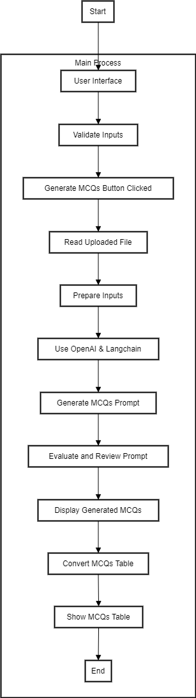

# MCQ Generator


## Table of Contents
- [Project Flow](#project-flow)
- [Introduction](#introduction)
- [Features](#features)
- [Installation](#installation)
- [Usage](#usage)
- [Contributing](#contributing)
- [License](#license)
- [Contact](#contact)

## Project-Flow
<div align="center">

</div>

## Introduction

This project demonstrates the use of OpenAI's language models and Lanchain to generate multiple-choice questions (MCQs) from provided text and templates. Unlike traditional tools, which often rely on static rules or databases, this approach leverages the dynamic capabilities of OpenAI's powerful language models to produce contextually relevant MCQs.

## Features

- **Text Input**: Input text from which MCQs will be generated.
- **Automatic Question Generation**: Uses natural language processing (NLP) to generate meaningful questions.
- **Multiple-Choice Options**: Provides plausible distractors (incorrect options) along with the correct answer.
- **Customization**: Adjust the number of questions and complexity.

## Installation

To get started with the MCQ Generator, follow these steps:

1. **Clone the repository:**
   ```bash
   git clone https://github.com/AY-Anish-Yadav/MCQ_GENERATOR.git
   cd MCQ_GENERATOR

2. **Install the required dependencies:**
   ```bash
   pip install -r requirements.txt

## Usage
Here's a basic example of how to use the MCQ Generator:

Prepare your input text:
Make sure you have a text file (input.txt) with the content you want to generate MCQs from.

Run the script:
   ```bash
   streamlit run app.py
   ```

## Contributing

Contributions are welcome! If you would like to contribute to the project.

## License

This project is licensed under the Apache 2.0 License - see the LICENSE file for details.

## Contact

For any inquiries or feedback, feel free to contact:

Anish Yadav - reach.anish.yadav@gmail.com


  